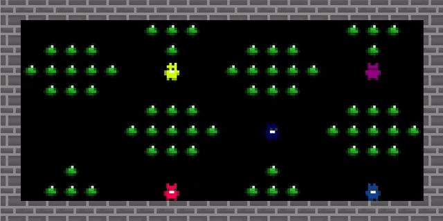
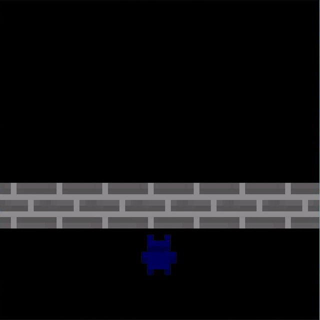

# Coding a new substrate for Melting Pot

This tutorial will guide you through the process of creating a new substrate. By
the end of this tutorial, you will have a fully functioning game, a binary to
allow you to play it interactively, and minimal tests in Lua and Python.

By the end, your game will look like this:



## Getting started

The code for this tutorial is in `meltingpot/docs/substrate_tutorial`, and you
can try it out like this:

<code class="lang-shell"><pre>
$ # Run the empty game
$ <kbd>python3 meltingpot/examples/tutorial/harvest/play_harvest.py --observation WORLD.RGB --display_text</kbd>
</pre></code>


You should see a blank window called `Melting Pot: harvest` with the text `This
page intentionally left blank` like in the above image.

If you get an error like:

```shell
UnboundLocalError: local variable 'game_display' referenced before assignment
```

make sure you are including the `-- --observation WORLD.RGB` parameter in your
command. The reson for this is that the empty substrate only has two
observations: `WORLD.RGB` and `WORLD.TEXT`. We will add more later on, including
the default per-player `RGB` one.

### Fully working example

If you just want to skip ahead and look at the finished game, simply change the
import in
[`play_harvest.py`](https://github.com/deepmind/meltingpot/tree/main/meltingpot/substrate_tutorial/harvest/play_harvest.py)
from

```python
from meltingpot.tutorial.harvest.configs.environment import harvest as game
```

to

```python
from meltingpot.tutorial.harvest.configs.environment import harvest_finished as game
```

and launch as desired:

```shell
python3 meltingpot/tutorial/harvest/play_harvest.py
```

for _first person_ view; or

```shell
python3 meltingpot/tutorial/harvest/play_harvest.py --observation WORLD.RGB
```

for _third person_ view.

## A minimal _game_

Ok, we can launch an empty game, but that is certainly not very interesting. Let
us, at least, have an avatar that we can move around.

The first thing to do is to set our number of players to 1 and add the
individual observation to the config in
[`harvest.py`](https://github.com/deepmind/meltingpot/tree/main/meltingpot/substrate_tutorial/harvest/configs/environment/harvest.py):

```python
  config.num_players = 1
  config.individual_observation_names = ["RGB"]
```

Everything in our substrate, including avatars, is a `GameObject`. You can think
of `GameObject`s as _dumb_ containers of functionality. Functionality is
provided via `Component`s. You can learn details of how components work in the
[concepts page](../concepts.md). For the purposes of this tutorial, just think of
`GameObject`s as the elements of your substrate, and `Component`s as modular
game logic you add to them.

### The Avatar

To instantiate the player in the game, we need a `GameObject` with the avatar
component. This is contained in
[`avatar_library.lua`](https://github.com/deepmind/meltingpot/tree/main/meltingpot/lua/modules/avatar_library.lua).

Defining a game object is done in the python substrate configuration, just like
we set the `config.num_players` above. Let's define our avatar `GameObject` by
adding the following as a global:

```python
AVATAR = {
    "name": "avatar",
    "components": [
        {
            "component": "StateManager",
            "kwargs": {
                "initialState": "player",
                "stateConfigs": [
                    {"state": "player",
                     "layer": "upperPhysical",
                     "sprite": "Avatar",},
                ]
            }
        },
        {
            "component": "Transform",
        },
        {
            "component": "Appearance",
            "kwargs": {
                "spriteNames": ["Avatar"],
                "spriteRGBColors": [(0, 0, 128)],
                "palettes": [{}],  # Will be overridden.
            }
        },
        {
            "component": "Avatar",
            "kwargs": {
                "aliveState": "player",
                "waitState": "playerWait",
                "spawnGroup": "spawnPoints",
                "view": {
                    "left": 3,
                    "right": 3,
                    "forward": 5,
                    "backward": 1,
                    "centered": False,
                }
            }
        },
    ]
}
```

Let's look a bit into what is going on here. The `AVATAR` is what we call a
_prefab_: a template from which actual `GameObject`s will be built. This is not
an actual `GameObject`, but think of this as the configuration needed to make
one.

Prefabs have the following structure:

```python
{
    "name": "some_name",  # The name of the prefab. An arbitrary string.
    "components": [  # A list of components for the GameObject.
        # You can add as many components as you want. Even of the same type.
    ]
}
```

If you want to learn more about this format, check out our
[detailed documentation](../substrates.md#specifying-gameobjects-as-prefabs)

The components `StateManager` and `Transform` are required. We'll discuss states
a bit more later, but if you want to understand this better, you can check their
[documentation](../concepts.md#statemanager). For now, think of a `GameObject`s
state as its _look and feel_.

### Defining spawn points

Now that we have our avatar configured, can we see it in action? Not quite! We
need a couple of things before. First, in addition to the avatar prefab, we need
some spawn points for our players. How do we specify those? You guessed it! We
need a prefab for the spawn points[^spawn]. Add the following to your
`harvest.py` config:

```python
SPAWN_POINT = {
    "name": "spawn_point",
    "components": [
        {
            "component": "StateManager",
            "kwargs": {
                "initialState": "spawnPoint",
                "stateConfigs": [{
                    "state": "spawnPoint",
                    "groups": ["spawnPoints"],
                }],
            }
        },
        {
            "component": "Transform",
        },
    ]
}
```

This one is much simpler. The only critical part is the `"groups"` parameter
which corresponds to the `"spawnGroup"` in our Avatar component above. This is
saying that `"spawnPoints"` is both, the group of the spawn point `GameObject`,
as well as the locations that our avatars will use for sapwning.

### Putting it all together

Finally, we need to specify the ASCII map, the mapping of ASCII chars to
prefab name, and a mapping of prefab name to the actual prefab. We do this in
the `lab2d_settings` part of the config. In the end, they should look like this:

```python
  config.substrate.lab2d_settings = {
      "levelName": "harvest",
      "levelDirectory":
          "meltingpot/substrate_tutorial/harvest/levels",
      "maxEpisodeLengthFrames": 100,
      "numPlayers": 1,
      "spriteSize": 8,
      "simulation": {
          "map": "  _  ",
          "prefabs": {
              "avatar": AVATAR,
              "spawn_point": SPAWN_POINT,
          },
          "charPrefabMap": {"_": "spawn_point"},
          "playerPalettes": [],
      },
  }
```

**NOTE**: The engine (DMLab2d) uses the term "level" instead of our term
"substrate".

**NOTE**: You can create the map that you want, we just provided `"  _  "` as an
          example. We will expand it later.

#### Why do we not just provide a mapping from ASCII chars to prefabs directly?

The main reason is because we often want to have one char to map not just to
_one_ prefab, but a collection of them, or a choice between prefabs. For this
substrate we won't need this functionality, but if you are interested, read
about [prefab specifications](../substrates.md#prefab-specification).

#### Key-word arguments to components

You might have noticed we specify `Component` parameters by making `"kwargs"`.
These corresponds to the constructor parameters of the `Component`. Some of
these are optional, and will have a default value in the constructor itself.
Whatever value is specified in Python will override the default.

For instance, you can see the arguments for the Avatar `Component`
[here](https://github.com/deepmind/meltingpot/tree/main/meltingpot/lua/modules/avatar_library.lua).

#### How does it look now?

Running the game should produce something like the following:


You can move around with `WASD`, and turn with `Q` & `E`... Of course, you
cannot really see which way you are going since our avatar is just a colored
square. Let's improve our visuals!

## Improvements to the visuals

In this section we will add another prefab for walls in the substrate, and
improve the avatar looks, both with sprites.

By now you should be able to guess that all that is needed to change the
appearance of an object is to... well, change its Appearance `Component`.

We have some useful sprites in the
[`shapes.py`](https://github.com/deepmind/meltingpot/tree/main/meltingpot/python/utils/substrates/shapes.py) library.

Let's import it (don't forget to add the dependency):

```python
from meltingpot.python import shapes
```

and change our avatar's Appearance `Component` to:

```python
        {
            "component": "Appearance",
            "kwargs": {
                "renderMode": "ascii_shape",
                "spriteNames": ["Avatar"],
                "spriteShapes": [shapes.CUTE_AVATAR],
                "palettes": [{}],  # Will be overridden
                "noRotates": [True],
            }
        },
```

Let's add walls to the substrate by pasting this `WALL` prefab:

```python
WALL = {
    "name": "wall",
    "components": [
        {
            "component": "StateManager",
            "kwargs": {
                "initialState": "wall",
                "stateConfigs": [{
                    "state": "wall",
                    "layer": "upperPhysical",
                    "sprite": "Wall",
                }],
            }
        },
        {
            "component": "Transform",
        },
        {
            "component": "Appearance",
            "kwargs": {
                "renderMode": "ascii_shape",
                "spriteNames": ["Wall",],
                "spriteShapes": [shapes.WALL],
                "palettes": [shapes.WALL_PALETTE],
                "noRotates": [True],
            }
        },
        {
            "component": "BeamBlocker",
            "kwargs": {
                "beamType": "gift"
            }
        },
        {
            "component": "BeamBlocker",
            "kwargs": {
                "beamType": "zap"
            }
        },
    ]
}
```

Finally, we need to update our ASCII map, add the wall to the `prefabs`, and a
character to the `charPrefabMap`. Our `lab2d_settings["simulation"]` now looks
like this:

```python
      "simulation": {
          "map": """
*******
*     *
*  _  *
*     *
*     *
*******
""",
          "prefabs": {
              "avatar": AVATAR,
              "spawn_point": SPAWN_POINT,
              "wall": WALL,
          },
          "charPrefabMap": {"_": "spawn_point", "*": "wall"},
          "playerPalettes": [],
      },
```

And now our substrate looks like this! Much nicer.


**NOTE**: The walls prevent avatars passing through them because they are on the
same layer (`upperPhysical`).

## Adding more objects and functionality

It's time to add some interactivity to our substrate. Start from this `APPLE`
prefab, and add an `Edible` component to it so it provides a reward to the
player whenever it is touched.

The overall changes needed are:

1.  Add a `"contact": "avatar"` to the avatar's `StateConfig`
2.  Add a prefab for the apple
    a.  Add two states, one for the _live_ (active) apple, one for the _wait_
        (dormant) one
    b.  Add an `Edible` component
3.  Add the apple to the `map`, `prefabs` and `charPrefabMap`

### 1. Add `contact` to the avatar state

Add `"contact": "avatar",` to the avatar's `"stateConfigs"`. It should now look
like this:

```python
                "stateConfigs": [
                    {"state": "player",
                     "layer": "upperPhysical",
                     "contact": "avatar",
                     "sprite": "Avatar",},
                ]
```

### 2. Add the `APPLE` prefab

The `APPLE` prefab should have two states, one where we actually show the apple,
and when touched is consumed for reward, and one in which the apple is invisible
and immaterial. You'll have to add these states to the `StateManager`.

#### Apple states

Let's start similar to our `WALL` prefab, except using the `shapes.APPLE`
sprite, and the `shapes.GREEN_COIN_PALETTE`. The `StateManager` should have two
states. One of them (call its `state` `"apple"`) having a `layer` and `sprite`.
The other one, only a state (call it `"appleWait"`). The `StateManager`
component should look like this:

```python
        {
            "component": "StateManager",
            "kwargs": {
                "initialState": "apple",
                "stateConfigs": [{
                    "state": "apple",
                    "layer": "lowerPhysical",
                    "sprite": "Apple",
                }, {
                    "state": "appleWait",
                }],
            }
        },
```

**NOTE**: The layer must be different than `"upperPhysical"` so that the avatar
can enter it. The usual layers are `background`, `lowerPhysical`,
`upperPhysical`, and `overlay`.

#### `Edible` component

The
[`Edible`](https://github.com/deepmind/meltingpot/tree/main/meltingpot/lua/modules/component_library.lua)
component takes 3 `kwargs`:

1.  `liveState`: The name of the state that is touchable and provides reward
2.  `waitState`: The immaterial or deactivated state, e.g. for after consumption
3.  `rewardForEating`: The numeric reward to players who touch it when live

Try adding this component yourself. Check the solution below if you need help.

<section class="zippy">
Full `APPLE` prefab with `Edible` component

```python
APPLE = {
    "name": "apple",
    "components": [
        {
            "component": "StateManager",
            "kwargs": {
                "initialState": "apple",
                "stateConfigs": [{
                    "state": "apple",
                    "layer": "lowerPhysical",
                    "sprite": "Apple",
                }, {
                    "state": "appleWait",
                }],
            }
        },
        {
            "component": "Transform",
        },
        {
            "component": "Appearance",
            "kwargs": {
                "renderMode": "ascii_shape",
                "spriteNames": ["Apple",],
                "spriteShapes": [shapes.APPLE],
                "palettes": [shapes.GREEN_COIN_PALETTE],
                "noRotates": [True],
            }
        },
        {
            "component": "Edible",
            "kwargs": {
                "liveState": "apple",
                "waitState": "appleWait",
                "rewardForEating": 1.0,
            }
        },
    ]
}
```

</section>

### 3. Add to substrate

Like before, we need to add the new prefab to the map. Let's use `"A"` as the
character in the ASCII map, and call the prefab `"apple"`.

<section class="zippy">
`lab2d_settings`

```python
  config.lab2d_settings = {
      "levelName": "harvest",
      "levelDirectory":
          "meltingpot/tutorial/harvest/levels",
      "maxEpisodeLengthFrames": 100,
      "numPlayers": 5,
      "spriteSize": 8,
      "simulation": {
          "map": """
*******
*   A *
*  _  *
* A   *
*   A *
*******
""",
          "prefabs": {
              "avatar": AVATAR,
              "spawn_point": SPAWN_POINT,
              "wall": WALL,
              "apple": APPLE,
          },
          "charPrefabMap": {"_": "spawn_point", "*": "wall", "A": "apple"},
          "playerPalettes": [],
      },
  }
```

</section>


### Debugging your components

If a component you've added doesn't function in the way you anticipate, an easy
way to debug the substrate is to launch it with the `--verbose` flag.

```shell
python3 meltingpot/tutorial/harvest/play_harvest.py --verbose True
```

This flag will activate the `verbose_fn` function in `play_harvest.py`, where
you can utilize the `unused_timestep` object to print out different attributes.

```python
def verbose_fn(unused_timestep, unused_player_index: int) -> None:
```

## Adding your own components

So far we have only used pre-existing components. However, what if we want
functionality that doesn't yet exist? For this, we need to create a new
`Component` in Lua. By convention, we put these in a file called
`components.lua` in the same directory as our `init.lua`. Also, we have to
`require` the file in `init.lua` so that the components defined there will be
available.

### The `DensityRegrow` custom component

In this section we will create a component called `DensityRegrow` that will
stochastically switch a dormant apple back to life, but only if there are other
apples in its immediate vicinity.

Let's start by creating `components.lua` and putting this boilerplate in it:

```lua
local args = require 'common.args'
local class = require 'common.class'
local helpers = require 'common.helpers'
local log = require 'common.log'
local random = require 'system.random'
local meltingpot = 'meltingpot.lua.modules.'
local component = require(meltingpot .. 'component')
local component_registry = require(meltingpot .. 'component_registry')


-- DensityRegrow makes the containing GameObject switch from `waitState` to
-- `liveState` at a rate based on the number of surrounding objects in
-- `liveState` and the configured `baseRate`.
local DensityRegrow = class.Class(component.Component)


local allComponents = {
    DensityRegrow = DensityRegrow,
}

component_registry.registerAllComponents(allComponents)

return allComponents
```

**IMPORTANT**: Don't forget to add a `require` to your `init.lua` (e.g. right
               below the `require` for the `avatar_library`.

```lua
local components = require 'components'
```

Now let's define the constructor of our component. Whichever parameters we
accept here are the ones we can specify when building our prefab. For the
`DensityRegrow`, we want to control the base rate of regrowth as well as the
radius defining the neighborhood. For simplicity we will just make it that the
regrow rate is directly proportional to the number of alive apples in the
neighborhood.

Our constructor looks like this:

```lua
function DensityRegrow:__init__(kwargs)
  kwargs = args.parse(kwargs, {
      {'name', args.default('DensityRegrow')},
      -- `baseRate` indicates the base probability per frame of switching from
      -- wait state to live state.
      {'baseRate', args.ge(0.0), args.le(1.0)},
      -- The name of the state representing the active or alive state.
      {'liveState', args.stringType},
      -- The name of the state representing the inactive or dormans state.
      {'waitState', args.stringType},
      -- The radius of the neighborhood
      {'neighborhoodRadius', args.numberType, args.default(1)},
      -- The layer to query for objects in `liveState`
      {'queryLayer', args.stringType, args.default("lowerPhysical")},
  })
  DensityRegrow.Base.__init__(self, kwargs)

  self._config.baseRate = kwargs.baseRate
  self._config.liveState = kwargs.liveState
  self._config.waitState = kwargs.waitState
  self._config.neighborhoodRadius = kwargs.neighborhoodRadius
  self._config.queryLayer = kwargs.queryLayer
end
```

Notice the use of the
[`args.lua`](https://github.com/deepmind/lab2d/blob/main/dmlab2d/game_scripts/common/args.lua)
module to specify the arguments, their type, range, and default values.
Arguments with default values can be omitted in the prefab specification.

By convention, we save the parsed arguments into the `self._config` table, but
you can do differently is desired.

Now we just need to specify the logic of regrowth. We do this by registering an
updater which will be called every frame that our `GameObject` (containing the
`DensityRegrow` component) is in its `waitState`:

```lua
function DensityRegrow:registerUpdaters(updaterRegistry)
  updaterRegistry:registerUpdater{
      state = self._config.waitState,
      updateFn = function()
          local transform = self.gameObject:getComponent("Transform")
          -- Get neighbors
          local objects = transform:queryDiamond(
              self._config.queryLayer, self._config.neighborhoodRadius)
          -- Count live neighbors
          local liveNeighbors = 0
          for _, object in pairs(objects) do
            if object:getState() == self._config.liveState then
              liveNeighbors = liveNeighbors + 1
            end
          end
          local actualRate = liveNeighbors * self._config.baseRate
          if random:uniformReal(0, 1) < actualRate then
            self.gameObject:setState(self._config.liveState)
          end
        end,
  }
end
```

To learn more about _updaters_ read
[our documentation](../concepts.md#updaters-or-update)

All that is left, is adding this component to our `APPLE` prefab.

```python
        {
            "component": "DensityRegrow",
            "kwargs": {
                "liveState": "apple",
                "waitState": "appleWait",
                "baseRate": 0.1,
            }
        },
```

**NOTE**: If you get the error:
          `component_registry.lua:25: The component DensityRegrow does not exist in the registry.`
          you might have forgotten to `require` the `components` in `init.lua`,
          or you might have skipped the footer in `components.lua` with
          `component_registry.registerAllComponents(...)`

## The final version

Now that we have all the pieces we need, let's scale up our ASCII map, add some
more players (and spawn points!), and make episodes last longer.

First set `config.num_players = 5`. The rest of the changes go in
`lab2d_settings` you can try it on your own, but if get stuck, check ours:

<section class="zippy">
`lab2d_settings`

```python
  ascii_map = """
**********************
*      AAA       AAA *
* AAA   A   AAA   A  *
*AAAAA  _  AAAAA  _  *
* AAA       AAA      *
*      AAA       AAA *
*     AAAAA  _  AAAAA*
*      AAA       AAA *
*  A         A       *
* AAA   _   AAA   _  *
**********************
  """

  # Lua script configuration.
  config.lab2d_settings = {
      "levelName": "harvest_finished",
      "levelDirectory":
          "meltingpot/tutorial/harvest/levels",
      "maxEpisodeLengthFrames": 1000,
      "numPlayers": 5,
      "spriteSize": 8,
      "simulation": {
          "map": ascii_map,
          ...
```

</section>

You can also launch the interactive substrate using the player view instead of
the third person one. Simply by remove the `--observation WORLD.RGB` flag:

```shell
python3 meltingpot/tutorial/harvest/play_harvest.py
```

You should see something like this:



**NOTE**: You can swap between them in the interactive window by pressing `TAB`.

**WARNING**: If you see an error like
             `UnboundLocalError: local variable 'game_display' referenced before assignment`,
             you might have forgotten to set the `individual_observation_names`
             to `["RGB"]`.

## Making a substrate

We provide a [builder](https://github.com/deepmind/meltingpot/tree/main/meltingpot/python/utils/substrates/builder.py)
that adapts the raw `Lab2d` substrate into an interface compatible with
`dm_env`. This adaptor exposes a multi-agent API, where the action and
observation specs are lists of the single-agent specs. The observation produced
by the substrate is a list of single-agent observations, one for each of the
players. Likewise, the action is provided as a list of single-agent actions, one
per player.

## Notes

[^spawn]: You can define a single prefab for spawn points, but you must have
    sufficient spawn points in the map for all the avatars that will use them.
    You can have different avatars use different spawn points. Simply create
    different prefabs for the spawn points with different group names, and set
    the avatar's `spawnGroup` parameter to the desired one.
